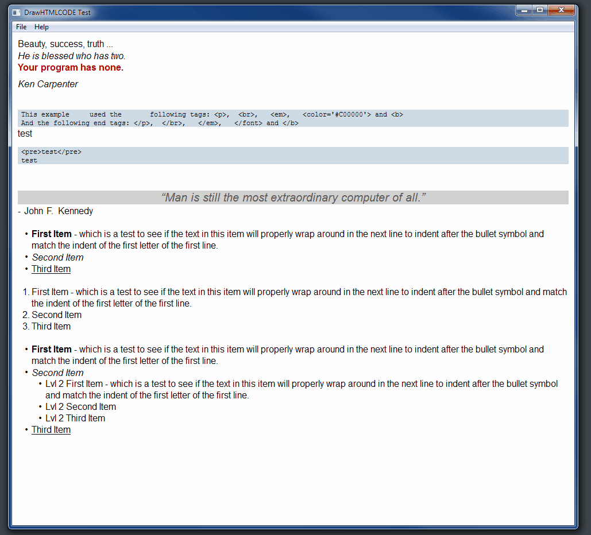

# DrawTextEXT
Extended DrawText function with html and bbcode support

Adapted from DrawHTML code posted by Ukkie9:  https://www.codeproject.com/Articles/7936/DrawHTML

## Setup DrawTextEXT

* Download the latest version of the DrawTextEXT release and extract the files. The latest release can be found in the [releases](https://github.com/mrfearless/DrawTextEXT/tree/master/releases) folder, or can be downloaded directly from [here](https://github.com/mrfearless/DrawTextEXT/blob/master/releases/DrawTextEXT.zip?raw=true).
* Copy the `DrawTextEXT.inc` file to your project's folder
* Copy the `DrawTextEXT.asm` file to your project's folder
* Add the following to your project:
```assembly
include DrawTextEXT.asm
```
* Call the `DrawHTMLCODE` or `DrawBBCODE` function in your code, preferably in a control's `WM_PAINT` event:
```assembly
Invoke DrawHTMLCODE, hdc, Addr szText, -1, Addr rect, DT_WORDBREAK
```
## DrawHTMLTest

A RadASM example project is included to demonstrate the `DrawHTMLCODE` function. It can be found in the [releases](https://github.com/mrfearless/DrawTextEXT/tree/master/releases) folder, or can be downloaded directly from [here](https://github.com/mrfearless/DrawTextEXT/blob/master/releases/DrawHTMLTest.zip?raw=true).

 

The picture above shows the `DrawHTMLTest` example using `DrawHTMLCODE` with the following text defined in a variable:

```
<p>Beauty, success, truth ...
<br><em>He is blessed who has two.</em>
<br><color='#C00000'><b>Your  program has  none.</b></color>
<p><em>Ken Carpenter</em>
<br><a href='www.google.com'>Google</a> test
<pre>This example     used the    following tags: <p>,  <br>,   <em>,   <color='#C00000'> and <b></pre>
<pre>And the following end tags: </p>,  </br>,   </em>,   </font> and </b></pre>
<br>test
<code><pre>test</pre></code>
<code>test</code>
<quote>Man is still the most extraordinary computer of all.</quote>
<br> - John F. Kennedy
<hr>
<ul>
  <li><b>List 1 - First Item</b> - which is a test to see if the text in this item will properly wrap around in the next line to indent after the bullet symbol and match the indent of the first letter of the first line.</li>
  <li><em>List 1 - Second Item</em></li>
</ul>
<ol>
  <li><b>List 2 - First Item</b> - which is a test to see if the text in this item will properly wrap around in the next line to indent after the bullet symbol and match the indent of the first letter of the first line.</li>
  <li><em>List 2 - Second Item</em></li>
</ol>
<ul>
  <li><b>List 3 - First Item</b> - which is a test to see if the text in this item will properly wrap around in the next line to indent after the bullet symbol and match the indent of the first letter of the first line.</li>
  <li><em>List 3 - Second Item</em></li>
    <ul>
      <li><b>List 3 - Lvl 2 - First Item</b> - which is a test to see if the text in this item will properly wrap around in the next line to indent after the bullet symbol and match the indent of the first letter of the first line.</li>
      <li><em>List 3 - Lvl 2 - Second Item</em></li>
    </ul>
  <li><u>List 3 - Third Item</u></li>
</ul> 
```

Demo of text wrapping feature:



## Todo

Note: I am still working on the bbcode version, so I would suggest not using it at the moment as I haven't refactored it or tested it currently. 

The html tag `<a href="url">title</a>` in the `DrawHTMLCODE` function doesn't currently work other than to display the title text. No mouse over, mouse click, cursor change or font normal | underline. I'm still thinking up a way to implement this.

Also, there might be bugs in the code, errors with rendering the text, line heights incorrect, odd placements of text or other things that I haven't caught yet, so if you notice anything odd let me know. Thanks.

## Additional Resources

* [RadASM IDE](http://www.softpedia.com/get/Programming/File-Editors/RadASM.shtml)
* [Masm32](http://www.masm32.com/masmdl.htm)
* [UASM](http://www.terraspace.co.uk/uasm.html)

If you like this project and would like to support me, consider buying me a coffee: [buymeacoffee.com/mrfearless](https://www.buymeacoffee.com/mrfearless)